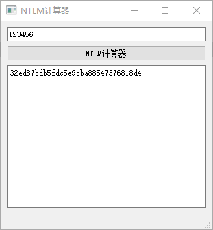

# Ntml-hash-calculator

> Test pyqt5 打包起来太大了



``` python
def NTML():
    NTML_hash = hashlib.new('md4')
    NTML_hash.update(str1.encode('utf-16le'))
    res = str(binascii.hexlify(NTML_hash.digest()),encoding="utf-8")
```
